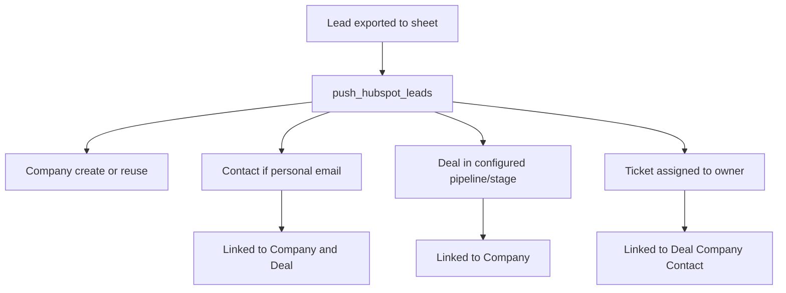

# HubSpot and `.env` configuration guide

This document explains how to configure HubSpot and the SkySnap `.env` file so the lead engine can **deduplicate**, **push CRM records**, and **create follow-up tasks** optimally.

SkySnap uses HubSpot in two modes:

| Mode | When | API access |
|------|------|------------|
| **Read (dedupe)** | During `run-daily` | Company search + **deal similarity** (project-level) |
| **Write (push)** | After a lead is exported to Google Sheets | Company, Contact, Deal, Task |

Push is **off by default** until you set `SKYSNAP_HUBSPOT_PUSH_ENABLED=true` and grant write scopes.

---

## Recommended rollout (3 phases)

### Phase 1 — Dedupe only (safe start)

1. Create a HubSpot **private app** with read scopes (`crm.objects.companies.read`, `crm.objects.deals.read`).
2. Set `HUBSPOT_PRIVATE_APP_TOKEN` in `.env`.
3. Leave `SKYSNAP_HUBSPOT_PUSH_ENABLED=false`.
4. Add **`Deal Similarity`** header to row 1 of your Google Sheet.
5. Run `python -m skysnap check-config` — expect `hubspot.ok: true` and deal read probe OK.

Leads are flagged as duplicates in the Google Sheet (`DN` column) but nothing is created in HubSpot.

### Phase 2 — CRM push (Deal + Company + Contact)

1. Add write scopes to the private app (see below).
2. Set pipeline/stage IDs and `SKYSNAP_HUBSPOT_PUSH_ENABLED=true`.
3. Run `python -m skysnap push-hubspot --all --dry-run`, then live push.

### Phase 3 — Follow-up tasks (contact the lead)

1. Add **`crm.objects.tasks.write`** if available in your private app scope picker (search “task”).
2. Set `HUBSPOT_TASK_OWNER_ID` (and optional `HUBSPOT_TASK_DUE_DAYS=7`).
3. Verify `hubspot_push.tasks_ready: true` in `check-config`.

Tasks are created in **one API call** with associations to Deal (216), Company (**192**), and Contact (204 when present).

---

## Step 1: Create a HubSpot private app

1. Log in to [HubSpot](https://app.hubspot.com/).
2. Open **Settings** (gear icon, top right).
3. Go to **Integrations** → **Private Apps**.
4. Click **Create a private app**.
5. Name it e.g. `SkySnap Lead Engine`.
6. Open the **Scopes** tab and enable:

| Scope | Required for |
|-------|----------------|
| `crm.objects.companies.read` | Company dedupe + deal association lookup |
| `crm.objects.deals.read` | Project similarity vs existing HubSpot deals |
| `crm.objects.companies.write` | Create/link companies on push |
| `crm.objects.contacts.write` | Create contacts (personal email only) |
| `crm.objects.deals.write` | Create deals on push |
| `crm.objects.tasks.write` | Create follow-up tasks (assignable to a sales owner) |
| `crm.objects.notes.write` | Create timeline Notes with full SkySnap agent analysis |

7. Create the app and copy the **access token** (starts with `pat-` or `pat-na1-`).

Paste it into `.env`:

```env
HUBSPOT_PRIVATE_APP_TOKEN=pat-na1-xxxxxxxx-xxxx-xxxx-xxxx-xxxxxxxxxxxx
```

**Security:** Never commit `.env` or the token to git. Rotate the token if leaked.

---

## Step 2: Copy `.env.example` and fill HubSpot variables

```powershell
copy .env.example .env
```

Edit `.env` in the project root. SkySnap loads it automatically (`python -m skysnap …`).

---

## HubSpot variables (detailed)

### `HUBSPOT_PRIVATE_APP_TOKEN`

| | |
|---|---|
| **Purpose** | Authenticates all HubSpot API calls (dedupe + push). |
| **Required** | Yes, for any HubSpot feature. |
| **Where to find** | HubSpot → Settings → Integrations → Private Apps → your app → **Access token** tab. |
| **Format** | Long string, typically `pat-na1-…` |

---

### `SKYSNAP_HUBSPOT_PUSH_ENABLED`

| | |
|---|---|
| **Purpose** | Master switch for **writing** to HubSpot (Deal, Company, Contact, Ticket). |
| **Default** | `false` |
| **Recommended** | `false` until pipeline IDs and scopes are ready; then `true`. |
| **Values** | `true` / `false` (also accepts `1`, `0`, `yes`, `no`) |

When `false`:

- Dedupe still works if the token is set.
- `push-hubspot` and automatic push in `run-pipeline` are skipped.

---

### `SKYSNAP_PROJECT_SIMILARITY_ENABLED`

| | |
|---|---|
| **Purpose** | Compare each new lead against existing HubSpot **deals** (project-level similarity). |
| **Default** | `true` |
| **Requires** | `crm.objects.deals.read` scope on the private app |
| **Sheet column** | **Deal Similarity** — e.g. `23% — different lot (vs KI: Budimex, Hala Radom)` |
| **Behavior** | Flag-only: always enriches and exports; does not block processing |

### `SKYSNAP_PROJECT_SIMILARITY_MIN_SCORE`

| | |
|---|---|
| **Purpose** | Minimum similarity % to append a short note in **komentarz** (default threshold: 60 when `0`). |
| **Default** | `0` (use built-in 60% note threshold) |

---

### `HUBSPOT_DEAL_PIPELINE_ID`

| | |
|---|---|
| **Purpose** | Tells HubSpot which **deal pipeline** new leads are placed in. |
| **Required for push** | Yes |
| **Maps to** | HubSpot deal property `pipeline` |

**How to find the pipeline internal ID:**

**Option A — HubSpot UI (Sales Hub)**

1. Go to **CRM** → **Deals**.
2. Click the pipeline dropdown (top) → **Manage pipelines**.
3. Hover a pipeline or open its settings — HubSpot often shows **Pipeline ID** in the URL or details panel.

**Option B — API (reliable)**

With your private app token:

```bash
curl -s "https://api.hubapi.com/crm/v3/pipelines/deals" \
  -H "Authorization: Bearer YOUR_TOKEN" | jq .
```

Use the `"id"` field of your target pipeline (e.g. `"default"` or a numeric string).

**Example:**

```env
HUBSPOT_DEAL_PIPELINE_ID=default
```

---

### `HUBSPOT_DEAL_STAGE_ID`

| | |
|---|---|
| **Purpose** | Initial **deal stage** for new leads (e.g. “Lead research”, “New”). |
| **Required for push** | Yes |
| **Maps to** | HubSpot deal property `dealstage` |

**How to find the stage internal ID:**

1. In the same pipelines API response, open `stages` for your pipeline.
2. Each stage has an `"id"` (internal) and `"label"` (display name).
3. Pick the stage where new Kompass leads should land.

```bash
curl -s "https://api.hubapi.com/crm/v3/pipelines/deals" \
  -H "Authorization: Bearer YOUR_TOKEN" \
  | jq '.results[] | {pipeline: .label, stages: [.stages[] | {id, label}]}'
```

**Example:**

```env
HUBSPOT_DEAL_STAGE_ID=appointmentscheduled
```

Use the **internal** `id`, not the visible label.

---

### `SKYSNAP_HUBSPOT_CREATE_TASK`

| | |
|---|---|
| **Purpose** | Create a HubSpot **Task** (“Skontaktuj się…”) on each successful push. |
| **Default** | `true` |
| **Requires** | `crm.objects.tasks.write` and `HUBSPOT_TASK_OWNER_ID` |

If `true` but owner ID is missing, Deal/Company/Contact still push; task is skipped with `task_skipped_reason` in the JSON output.

Tasks are created via `POST /crm/v3/objects/tasks` with an `associations` array (Deal 216, Company **192**, Contact 204).

---

### `SKYSNAP_HUBSPOT_TASK_WHEN`

| | |
|---|---|
| **Purpose** | Controls when a follow-up task is created. |
| **Default** | `always` |

| Value | Behavior |
|-------|----------|
| `always` | Task on every successful push (recommended for sales follow-up). |
| `personal_contact` | Task only when a HubSpot **Contact** was created (personal email found). |

---

### `HUBSPOT_TASK_OWNER_ID`

| | |
|---|---|
| **Purpose** | HubSpot **user ID** assigned as task owner. |
| **Required for tasks** | Yes (if `SKYSNAP_HUBSPOT_CREATE_TASK=true`) |

**How to find a user ID:**

**Option A — URL**

1. HubSpot → **Settings** → **Users & Teams**.
2. Click the user (e.g. sales rep).
3. Check the browser URL for `userId=12345678` — that number is the owner ID.

**Option B — Owners API**

```bash
curl -s "https://api.hubapi.com/crm/v3/owners" \
  -H "Authorization: Bearer YOUR_TOKEN" | jq '.results[] | {id, email, firstName, lastName}'
```

Use the numeric `"id"` field.

**Example:**

```env
HUBSPOT_TASK_OWNER_ID=12345678
```

---

### `HUBSPOT_TASK_TYPE`

| | |
|---|---|
| **Purpose** | HubSpot task type (`hs_task_type`). |
| **Default** | `CALL` |
| **Allowed** | `CALL`, `EMAIL`, `TODO` |

---

### `HUBSPOT_TASK_DUE_DAYS`

| | |
|---|---|
| **Purpose** | Task due date = today + N days at **09:00** in `SKYSNAP_TIMEZONE` (`hs_timestamp` Unix ms). |
| **Default** | `7` |

**Example:**

```env
HUBSPOT_TASK_DUE_DAYS=7
SKYSNAP_TIMEZONE=Europe/Warsaw
```

---

## Optional custom deal/company properties

SkySnap can map enrichment fields to **your** HubSpot custom properties. Leave blank to skip.

You need the property **internal name** (not the label shown in the UI).

**How to find internal names:**

1. HubSpot → **Settings** → **Data Management** → **Properties**.
2. Select object: **Deal** or **Company**.
3. Open a property → **Internal name** is in the property details (e.g. `project_url`, `icp_score`).

| `.env` variable | Written to | SkySnap source |
|-----------------|------------|----------------|
| `HUBSPOT_PROP_PROJECT_URL` | Deal (custom) | Kompass project URL |
| `HUBSPOT_PROP_PROJECT_NAME` | Deal (custom) | Project name (Nazwa inwestycji) |
| `HUBSPOT_PROP_ICP_SCORE` | Deal (custom) | ICP score (1–100) |
| `HUBSPOT_PROP_STAGE_INWESTYCJI` | Deal (dropdown) | Investment phase from enrichment |
| `HUBSPOT_PROP_DEAL_TYP` | Deal (dropdown) | publiczne / prywatne / publiczno-prawne |
| `HUBSPOT_PROP_DEAL_SOURCE` | Deal (dropdown) | Lead origin (marketing channel list) |
| `HUBSPOT_PROP_DEAL_BRANZA` | Deal (dropdown) | Sheet branża taxonomy |
| `HUBSPOT_PROP_DEAL_ROLE` | Deal (custom) | Sheet role (rola w projekcie) |
| `HUBSPOT_PROP_AI_SCORE` | Deal (custom) | Same AI/ICP score cell as sheet |
| *(always)* Deal `description` | Deal Opis transakcji | Kompass project description only |
| *(timeline Note)* | Deal activity | Full SkySnap agent analysis (`crm.objects.notes.write`) |
| `HUBSPOT_PROP_SEKTOR_PODSEKTOR` | Deal (checkbox) | Kompass Sektor, podsektor |
| `HUBSPOT_PROP_PROJECT_CITY` | Deal | Kompass Miasto |
| `HUBSPOT_PROP_PROJECT_VOIVODSHIP` | Deal (dropdown) | Kompass Województwo |
| `HUBSPOT_PROP_PROJECT_STREET` | Deal | Kompass Adres (street) |
| `HUBSPOT_PROP_PROJECT_BUILDING_NUMBER` | Deal | Building number when present |
| `HUBSPOT_PROP_NIP` | Company (custom) | Polish NIP from Kompass firm page |
| `HUBSPOT_PROP_OPIS` | Company (custom) | Kompass project description (Opis) |
| `HUBSPOT_PROP_BRANZA_SKYSNAP` | Company (dropdown) | Sheet branża taxonomy |
| `HUBSPOT_PROP_BRANZA_EXTRAINFO` | Company (custom) | Phase, value, ICP reason, role |
| `HUBSPOT_PROP_LEADS_SCORE` | Company (dropdown) | ICP score bucket P1–P4 |
| `HUBSPOT_PROP_LEADS_ORIGIN` | Company (dropdown) | Lead origin (e.g. Kompas Inwestycji) |
| `HUBSPOT_PROP_COMPANY_NOTES` | Company (custom) | SkySnap komentarz (metadata, not Kompass Opis) |
| `HUBSPOT_PROP_USLUGI` | Company (dropdown) | SkySnap services (leave blank — no source) |
| `HUBSPOT_PROP_VOIVODSHIP` | Company (dropdown) | Parsed from Kompass address |

### Dropdown (enumeration) properties

HubSpot rejects the **entire write request** when a dropdown property receives a
value outside its option list, which silently leaves fields empty. SkySnap reads
the live property schema before each push and normalizes values onto real
options, ignoring case, Polish diacritics, punctuation, and small typos
(`Generalni wykonawcy` → `Generalni Wykonawcy`, `Samorząd` → `Samorzad`).

Values that cannot be matched are skipped and reported per lead under
`dropped_properties` in the `push-hubspot` output, so nothing fails silently.

Two mappings are derived rather than copied verbatim:

- **Leads Score** is a `P1`–`P4` dropdown, so the ICP number is bucketed:
  `P1` ≥ 80, `P2` ≥ 65, `P3` ≥ 50, `P4` below 50.
- **Typ inwestycji** is `publiczne` / `prywatne` / `publiczno-prawne`. Prefer
  Kompass **Typ** (`Publiczna` → `publiczne`). Fall back to company-name
  heuristics only when Typ is missing (`Urząd`/`Gmina` → `publiczne`;
  `Sp. z o.o.`/`S.A.` → `prywatne`; `Spółdzielnia`/`Wspólnota` →
  `publiczno-prawne`).

Verify your mapping against the live schema at any time:

```powershell
python -m skysnap hubspot-props
```

Every configured property is listed with its type and allowed options, and
`"ok": false` plus a `problems` array flags names that do not exist or are
read-only.

Set `SKYSNAP_HUBSPOT_SYNC_COMPANY_FIELDS=false` to restore minimal company push (`name`, `domain`, `country`, NIP only).

**Example** (only if you created matching properties in HubSpot):

```env
HUBSPOT_PROP_PROJECT_URL=project_url
HUBSPOT_PROP_ICP_SCORE=icp_score
HUBSPOT_PROP_LEADS_ORIGIN=leads_origin
HUBSPOT_PROP_STAGE_INWESTYCJI=stage_inwestycji
HUBSPOT_PROP_NIP=nip
```

Standard HubSpot fields are always set without extra config:

| Object | Properties |
|--------|------------|
| **Company** | `name`, `domain`, `website`, `description` (Kompass Opis), `country`, `city`, `zip`, `state`, `address`, `phone`, `linkedin_company_page`, `hubspot_owner_id`, plus customs above when `SKYSNAP_HUBSPOT_SYNC_COMPANY_FIELDS=true` |
| **Contact** | `email`, `firstname`, `lastname`, `phone`, `jobtitle`, `hs_linkedin_url` (only if personal email) |
| **Deal** | `dealname`, `pipeline`, `dealstage`, `description` (komentarz), optional `ai_score` (+ optional customs) |

Deal name format matches the Google Sheet: `KI: {Company}, {Project name}`.

---

## Related `.env` variables (affect what reaches HubSpot)

These are not HubSpot-specific but change **which leads export** and **what data** is pushed.

| Variable | Default | Effect on HubSpot |
|----------|---------|-------------------|
| `SKYSNAP_MIN_SCORE` | `40` | Leads below this ICP are not processed. |
| `SKYSNAP_STAKEHOLDER_EXPORT_MIN_ICP` | `60` | Kompass tier can export GW/investor without personal email. |
| `SKYSNAP_TIMEZONE` | `Europe/Warsaw` | Ticket due dates; Kompass reveal daily quota. |
| `SKYSNAP_DAILY_LIMIT` | `5` | Kompass personal contact reveals per day (affects contact quality). |
| `KOMPASS_USERNAME` / `KOMPASS_PASSWORD` | — | Required for Phase A enrichment (better contacts → more HubSpot Contacts). |

---

## Optimal `.env` example (full HubSpot)

```env
# --- HubSpot ---
HUBSPOT_PRIVATE_APP_TOKEN=pat-na1-your-token-here

# Project similarity (deal dedupe flag — read-only)
SKYSNAP_PROJECT_SIMILARITY_ENABLED=true
SKYSNAP_PROJECT_SIMILARITY_MIN_SCORE=0

# Phase 2+: enable write sync
SKYSNAP_HUBSPOT_PUSH_ENABLED=true
HUBSPOT_DEAL_PIPELINE_ID=default
HUBSPOT_DEAL_STAGE_ID=appointmentscheduled

# Phase 3+: follow-up tickets
SKYSNAP_HUBSPOT_CREATE_TASK=true
SKYSNAP_HUBSPOT_TASK_WHEN=always
HUBSPOT_TASK_OWNER_ID=12345678
HUBSPOT_TASK_DUE_DAYS=1
HUBSPOT_TICKET_PIPELINE_ID=0
HUBSPOT_TICKET_STAGE_ID=1

# Optional custom properties (internal names from HubSpot)
HUBSPOT_PROP_PROJECT_URL=project_url
HUBSPOT_PROP_ICP_SCORE=icp_score
HUBSPOT_PROP_LEADS_ORIGIN=leads_origin
HUBSPOT_PROP_STAGE_INWESTYCJI=stage_inwestycji
HUBSPOT_PROP_NIP=nip

# Ticket due dates + Kompass quota timezone
SKYSNAP_TIMEZONE=Europe/Warsaw
```

---

## Verify configuration

```powershell
python -m skysnap check-config
```

Check the JSON output:

```json
{
  "hubspot": { "ok": true },
  "hubspot_push": {
    "enabled": true,
    "ready": true,
    "missing": [],
    "create_followup_ticket": true,
    "followup_ready": true,
    "followup_when": "always"
  }
}
```

| Field | Meaning |
|-------|---------|
| `hubspot.ok` | Token works; company search succeeded. |
| `hubspot_push.ready` | Push enabled and pipeline/stage/token present. |
| `hubspot_push.followup_ready` | Tickets enabled and owner + ticket pipeline/stage set. |
| `hubspot_push.followup_warning` | Tickets wanted but owner or ticket pipeline/stage missing. |

Write scopes are **not** fully testable without a live create call; if push fails with `403`, add missing scopes in the private app.

---

## Commands (workflow)

| Command | HubSpot behavior |
|---------|------------------|
| `run-daily` | Dedupe during enrichment (read). No push unless configured elsewhere. |
| `run-pipeline` | Ingest + daily + **auto push** for leads exported in that run. |
| `push-hubspot --lead-id N` | Push one exported lead. |
| `push-hubspot --all` | Push all exports not yet synced; adopts a matching existing deal instead of duplicating it. |
| `push-hubspot --all --dry-run` | Simulate push (no API writes). |
| `push-hubspot --resync` | PATCH company+deal for all previously synced exports. |
| `run-pipeline --skip-hubspot` | Daily run without HubSpot push. |

**Push prerequisites:**

1. Lead must be **exported to Google Sheets** first (`run-daily` success or `skipped_duplicate`).
2. A snapshot exists in SQLite (`lead_exports` table).
3. The current snapshot has not been pushed yet (`hubspot_synced_at` empty).

### Existing deals are adopted, not duplicated

Before creating anything, a push whose export has no stored HubSpot ids searches
for a deal with the same name (and takes the company associated with it). If one
exists, SkySnap updates that deal and company instead of creating a second copy.
Those pushes are flagged with `adopted_existing_deal: true` in the output.

This makes `backfill-exports` followed by `push-hubspot --all` safe: snapshots
rebuilt from the leads table carry no dedupe history, so without the name lookup
every one of them would create a duplicate deal. Running `link-hubspot` first is
now optional.

### Re-exported leads keep their HubSpot records

Re-running `run-daily` or `backfill-exports` for a lead that was already pushed
refreshes its snapshot and clears `hubspot_synced_at`, but **keeps**
`hubspot_deal_id` / `hubspot_company_id`. The next `push-hubspot --all`
therefore updates the same HubSpot company and deal instead of creating
duplicates or orphaning them.

If `push-hubspot` reports `target_count: 0`, the JSON now includes `db_path`,
`exports_total`, `exports_linked_to_hubspot`, and a `hint` telling you whether
to run `backfill-exports`, `link-hubspot`, or nothing at all.

**What gets created on push:**



Duplicates: if dedupe matched an existing **company**, SkySnap **updates** that company on push. If **project similarity** matches an existing deal (`same_project`, or `addon` with score ≥ `SKYSNAP_PROJECT_SIMILARITY_MIN_SCORE`), SkySnap **updates** that deal (stage/ICP/description/custom fields) instead of creating a duplicate. Set `SKYSNAP_HUBSPOT_UPDATE_EXISTING_DEALS=false` to always create a new deal.

---

## Troubleshooting

| Symptom | Likely cause | Fix |
|---------|--------------|-----|
| `hubspot.ok: false` | Invalid/expired token | Regenerate token in private app |
| `hubspot_push.ready: false` | Missing pipeline/stage/token | Fill `HUBSPOT_DEAL_*` and token |
| `403` on push | Missing write scope | Add scopes in private app, regenerate token |
| Tasks / tickets not created | No owner or ticket pipeline | Set `HUBSPOT_TASK_OWNER_ID`, `HUBSPOT_TICKET_PIPELINE_ID`, `HUBSPOT_TICKET_STAGE_ID` |
| `no export snapshot` | Lead never exported to sheet | Run `run-daily` first |
| `already synced` | Lead pushed before | Expected; use `--resync` to refresh fields |
| Custom property error | Wrong internal name | Run `hubspot-props`, then match `HUBSPOT_PROP_*` to the internal name |
| `target_count: 0` on `--resync` | No export is linked to a HubSpot deal | Run `link-hubspot`, then `--resync` |
| Dropdown field stays empty | Value is not one of the property options | Check `dropped_properties_summary` in the push output |

Push errors are stored per lead in SQLite: `lead_exports.hubspot_last_error`.

---

## See also

- [USAGE.md](USAGE.md) — daily operations and pipeline overview
- [PIPELINE.md](PIPELINE.md) — enrichment and export rules
- [.env.example](../.env.example) — all environment variables
